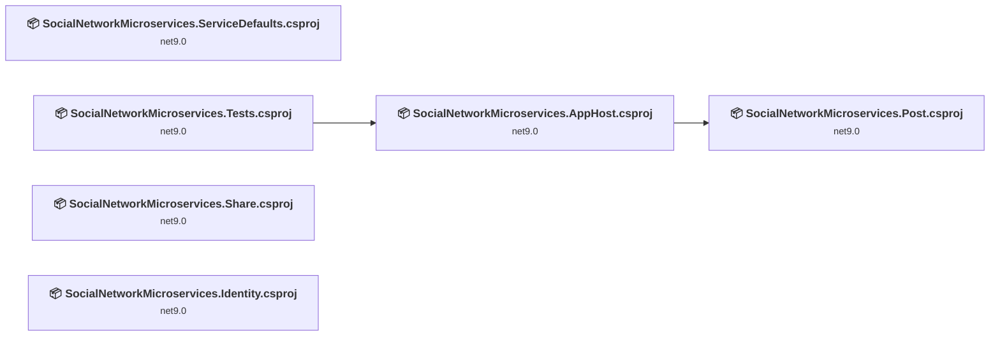
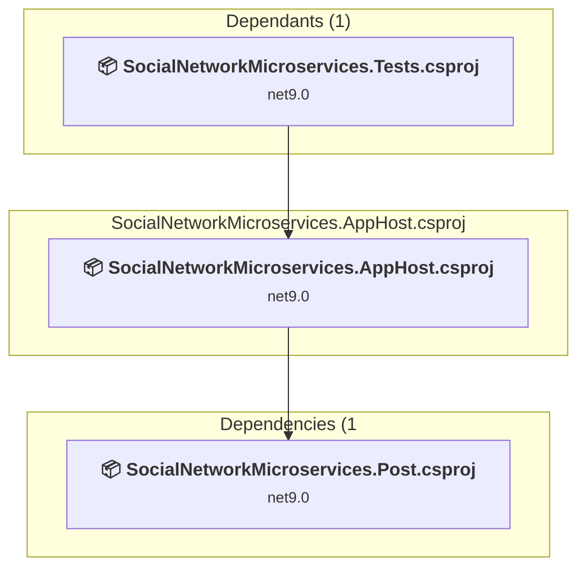
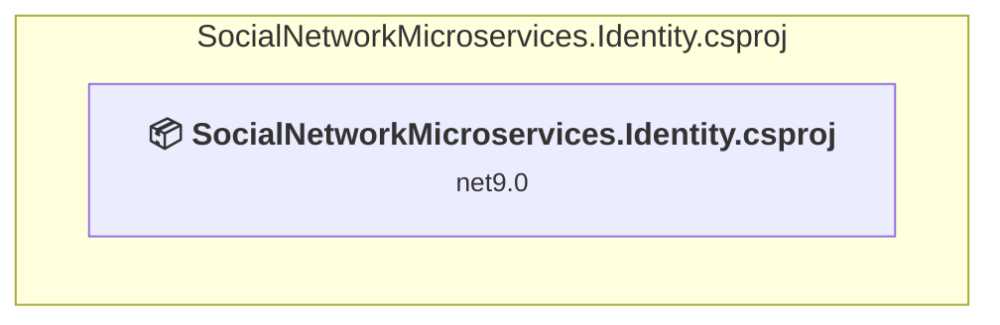
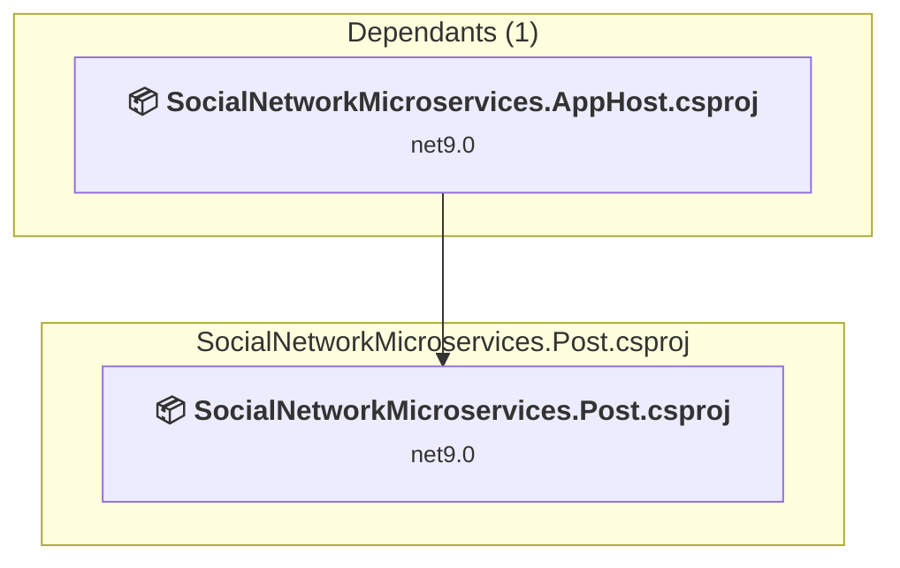
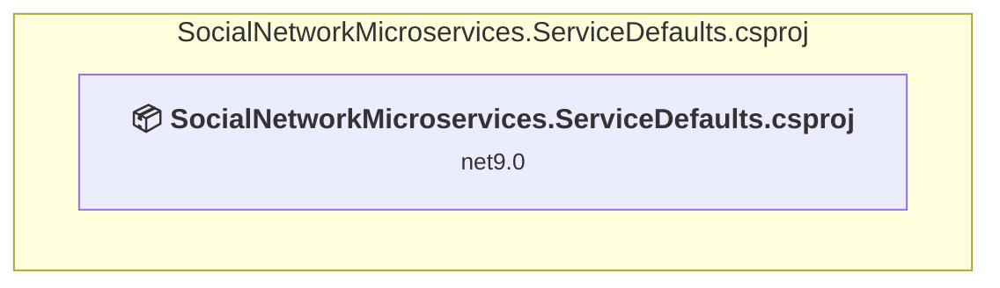
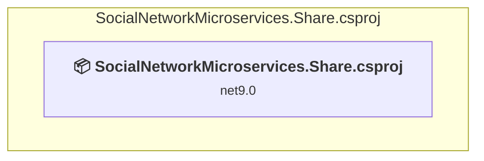
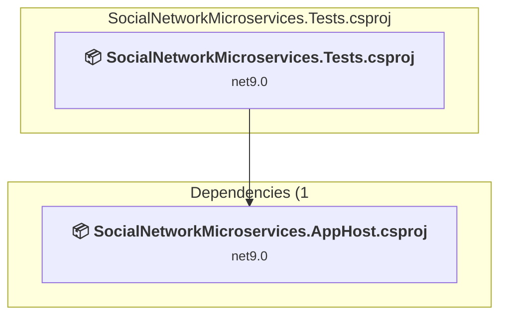

# Projects and dependencies analysis

This document provides a comprehensive overview of the projects and their dependencies in the context of upgrading to .NETCoreApp,Version=v10.0.

## Table of Contents

- [Executive Summary](#executive-Summary)
  - [Highlevel Metrics](#highlevel-metrics)
  - [Projects Compatibility](#projects-compatibility)
  - [Package Compatibility](#package-compatibility)
  - [API Compatibility](#api-compatibility)
- [Aggregate NuGet packages details](#aggregate-nuget-packages-details)
- [Top API Migration Challenges](#top-api-migration-challenges)
  - [Technologies and Features](#technologies-and-features)
  - [Most Frequent API Issues](#most-frequent-api-issues)
- [Projects Relationship Graph](#projects-relationship-graph)
- [Project Details](#project-details)

  - [SocialNetworkMicroservices.AppHost\SocialNetworkMicroservices.AppHost.csproj](#socialnetworkmicroservicesapphostsocialnetworkmicroservicesapphostcsproj)
  - [SocialNetworkMicroservices.Identity\SocialNetworkMicroservices.Identity.csproj](#socialnetworkmicroservicesidentitysocialnetworkmicroservicesidentitycsproj)
  - [SocialNetworkMicroservices.Post\SocialNetworkMicroservices.Post.csproj](#socialnetworkmicroservicespostsocialnetworkmicroservicespostcsproj)
  - [SocialNetworkMicroservices.ServiceDefaults\SocialNetworkMicroservices.ServiceDefaults.csproj](#socialnetworkmicroservicesservicedefaultssocialnetworkmicroservicesservicedefaultscsproj)
  - [SocialNetworkMicroservices.Share\SocialNetworkMicroservices.Share.csproj](#socialnetworkmicroservicessharesocialnetworkmicroservicessharecsproj)
  - [SocialNetworkMicroservices.Tests\SocialNetworkMicroservices.Tests.csproj](#socialnetworkmicroservicestestssocialnetworkmicroservicestestscsproj)

## Executive Summary

### Highlevel Metrics

| Metric | Count | Status |
| :--- | :---: | :--- |
| Total Projects | 6 | All require upgrade |
| Total NuGet Packages | 17 | 10 need upgrade |
| Total Code Files | 12 |  |
| Total Code Files with Incidents | 9 |  |
| Total Lines of Code | 463 |  |
| Total Number of Issues | 47 |  |
| Estimated LOC to modify | 24+ | at least 5.2% of codebase |

### Projects Compatibility

| Project | Target Framework | Difficulty | Package Issues | API Issues | Est. LOC Impact | Description |
| :--- | :---: | :---: | :---: | :---: | :---: | :--- |
| [SocialNetworkMicroservices.AppHost\SocialNetworkMicroservices.AppHost.csproj](#socialnetworkmicroservicesapphostsocialnetworkmicroservicesapphostcsproj) | net9.0 | 🟢 Low | 6 | 0 |  | DotNetCoreApp, Sdk Style = True |
| [SocialNetworkMicroservices.Identity\SocialNetworkMicroservices.Identity.csproj](#socialnetworkmicroservicesidentitysocialnetworkmicroservicesidentitycsproj) | net9.0 | 🟢 Low | 2 | 18 | 18+ | AspNetCore, Sdk Style = True |
| [SocialNetworkMicroservices.Post\SocialNetworkMicroservices.Post.csproj](#socialnetworkmicroservicespostsocialnetworkmicroservicespostcsproj) | net9.0 | 🟢 Low | 2 | 5 | 5+ | AspNetCore, Sdk Style = True |
| [SocialNetworkMicroservices.ServiceDefaults\SocialNetworkMicroservices.ServiceDefaults.csproj](#socialnetworkmicroservicesservicedefaultssocialnetworkmicroservicesservicedefaultscsproj) | net9.0 | 🟢 Low | 5 | 0 |  | ClassLibrary, Sdk Style = True |
| [SocialNetworkMicroservices.Share\SocialNetworkMicroservices.Share.csproj](#socialnetworkmicroservicessharesocialnetworkmicroservicessharecsproj) | net9.0 | 🟢 Low | 0 | 0 |  | ClassLibrary, Sdk Style = True |
| [SocialNetworkMicroservices.Tests\SocialNetworkMicroservices.Tests.csproj](#socialnetworkmicroservicestestssocialnetworkmicroservicestestscsproj) | net9.0 | 🟢 Low | 2 | 1 | 1+ | DotNetCoreApp, Sdk Style = True |

### Package Compatibility

| Status | Count | Percentage |
| :--- | :---: | :---: |
| ✅ Compatible | 7 | 41.2% |
| ⚠️ Incompatible | 0 | 0.0% |
| 🔄 Upgrade Recommended | 10 | 58.8% |
| ***Total NuGet Packages*** | ***17*** | ***100%*** |

### API Compatibility

| Category | Count | Impact |
| :--- | :---: | :--- |
| 🔴 Binary Incompatible | 13 | High - Require code changes |
| 🟡 Source Incompatible | 11 | Medium - Needs re-compilation and potential conflicting API error fixing |
| 🔵 Behavioral change | 0 | Low - Behavioral changes that may require testing at runtime |
| ✅ Compatible | 702 |  |
| ***Total APIs Analyzed*** | ***726*** |  |

## Aggregate NuGet packages details

| Package | Current Version | Suggested Version | Projects | Description |
| :--- | :---: | :---: | :--- | :--- |
| Aspire.Hosting.AppHost | 9.0.0 | 13.1.1 | [SocialNetworkMicroservices.AppHost.csproj](#socialnetworkmicroservicesapphostsocialnetworkmicroservicesapphostcsproj) | NuGet package upgrade is recommended |
| Aspire.Hosting.PostgreSQL | 9.0.0 | 13.1.1 | [SocialNetworkMicroservices.AppHost.csproj](#socialnetworkmicroservicesapphostsocialnetworkmicroservicesapphostcsproj) | NuGet package upgrade is recommended |
| Aspire.Hosting.Redis | 9.0.0 | 13.1.1 | [SocialNetworkMicroservices.AppHost.csproj](#socialnetworkmicroservicesapphostsocialnetworkmicroservicesapphostcsproj) | NuGet package upgrade is recommended |
| Aspire.Hosting.Testing | 9.0.0 | 13.1.1 | [SocialNetworkMicroservices.Tests.csproj](#socialnetworkmicroservicestestssocialnetworkmicroservicestestscsproj) | NuGet package upgrade is recommended |
| coverlet.collector | 6.0.2 |  | [SocialNetworkMicroservices.Tests.csproj](#socialnetworkmicroservicestestssocialnetworkmicroservicestestscsproj) | ✅Compatible |
| Microsoft.AspNetCore.Authentication.JwtBearer | 9.0.2 | 10.0.3 | [SocialNetworkMicroservices.Identity.csproj](#socialnetworkmicroservicesidentitysocialnetworkmicroservicesidentitycsproj) [SocialNetworkMicroservices.Post.csproj](#socialnetworkmicroservicespostsocialnetworkmicroservicespostcsproj) | NuGet package upgrade is recommended |
| Microsoft.AspNetCore.OpenApi | 9.0.2 | 10.0.3 | [SocialNetworkMicroservices.Identity.csproj](#socialnetworkmicroservicesidentitysocialnetworkmicroservicesidentitycsproj) [SocialNetworkMicroservices.Post.csproj](#socialnetworkmicroservicespostsocialnetworkmicroservicespostcsproj) | NuGet package upgrade is recommended |
| Microsoft.Extensions.Http.Resilience | 9.0.0 | 10.3.0 | [SocialNetworkMicroservices.ServiceDefaults.csproj](#socialnetworkmicroservicesservicedefaultssocialnetworkmicroservicesservicedefaultscsproj) | NuGet package upgrade is recommended |
| Microsoft.Extensions.ServiceDiscovery | 9.0.0 | 10.3.0 | [SocialNetworkMicroservices.ServiceDefaults.csproj](#socialnetworkmicroservicesservicedefaultssocialnetworkmicroservicesservicedefaultscsproj) | NuGet package upgrade is recommended |
| Microsoft.NET.Test.Sdk | 17.10.0 |  | [SocialNetworkMicroservices.Tests.csproj](#socialnetworkmicroservicestestssocialnetworkmicroservicestestscsproj) | ✅Compatible |
| OpenTelemetry.Exporter.OpenTelemetryProtocol | 1.9.0 |  | [SocialNetworkMicroservices.ServiceDefaults.csproj](#socialnetworkmicroservicesservicedefaultssocialnetworkmicroservicesservicedefaultscsproj) | ✅Compatible |
| OpenTelemetry.Extensions.Hosting | 1.9.0 |  | [SocialNetworkMicroservices.ServiceDefaults.csproj](#socialnetworkmicroservicesservicedefaultssocialnetworkmicroservicesservicedefaultscsproj) | ✅Compatible |
| OpenTelemetry.Instrumentation.AspNetCore | 1.9.0 | 1.15.0 | [SocialNetworkMicroservices.ServiceDefaults.csproj](#socialnetworkmicroservicesservicedefaultssocialnetworkmicroservicesservicedefaultscsproj) | NuGet package upgrade is recommended |
| OpenTelemetry.Instrumentation.Http | 1.9.0 | 1.15.0 | [SocialNetworkMicroservices.ServiceDefaults.csproj](#socialnetworkmicroservicesservicedefaultssocialnetworkmicroservicesservicedefaultscsproj) | NuGet package upgrade is recommended |
| OpenTelemetry.Instrumentation.Runtime | 1.9.0 |  | [SocialNetworkMicroservices.ServiceDefaults.csproj](#socialnetworkmicroservicesservicedefaultssocialnetworkmicroservicesservicedefaultscsproj) | ✅Compatible |
| xunit | 2.9.0 |  | [SocialNetworkMicroservices.Tests.csproj](#socialnetworkmicroservicestestssocialnetworkmicroservicestestscsproj) | ✅Compatible |
| xunit.runner.visualstudio | 2.8.2 |  | [SocialNetworkMicroservices.Tests.csproj](#socialnetworkmicroservicestestssocialnetworkmicroservicestestscsproj) | ✅Compatible |

## Top API Migration Challenges

### Technologies and Features

| Technology | Issues | Percentage | Migration Path |
| :--- | :---: | :---: | :--- |
| IdentityModel & Claims-based Security | 13 | 54.2% | Windows Identity Foundation (WIF), SAML, and claims-based authentication APIs that have been replaced by modern identity libraries. WIF was the original identity framework for .NET Framework. Migrate to Microsoft.IdentityModel.* packages (modern identity stack). |

### Most Frequent API Issues

| API | Count | Percentage | Category |
| :--- | :---: | :---: | :--- |
| T:System.IdentityModel.Tokens.Jwt.JwtRegisteredClaimNames | 4 | 16.7% | Binary Incompatible |
| F:System.IdentityModel.Tokens.Jwt.JwtRegisteredClaimNames.Jti | 2 | 8.3% | Binary Incompatible |
| F:System.IdentityModel.Tokens.Jwt.JwtRegisteredClaimNames.Sub | 2 | 8.3% | Binary Incompatible |
| P:Microsoft.AspNetCore.Authentication.JwtBearer.JwtBearerOptions.TokenValidationParameters | 2 | 8.3% | Source Incompatible |
| T:Microsoft.Extensions.DependencyInjection.JwtBearerExtensions | 2 | 8.3% | Source Incompatible |
| T:System.IdentityModel.Tokens.Jwt.JwtSecurityTokenHandler | 1 | 4.2% | Binary Incompatible |
| M:System.IdentityModel.Tokens.Jwt.JwtSecurityTokenHandler.#ctor | 1 | 4.2% | Binary Incompatible |
| M:System.IdentityModel.Tokens.Jwt.JwtSecurityTokenHandler.WriteToken(Microsoft.IdentityModel.Tokens.SecurityToken) | 1 | 4.2% | Binary Incompatible |
| T:System.IdentityModel.Tokens.Jwt.JwtSecurityToken | 1 | 4.2% | Binary Incompatible |
| M:System.IdentityModel.Tokens.Jwt.JwtSecurityToken.#ctor(System.String,System.String,System.Collections.Generic.IEnumerable{System.Security.Claims.Claim},System.Nullable{System.DateTime},System.Nullable{System.DateTime},Microsoft.IdentityModel.Tokens.SigningCredentials) | 1 | 4.2% | Binary Incompatible |
| T:Microsoft.AspNetCore.Authentication.JwtBearer.JwtBearerDefaults | 1 | 4.2% | Source Incompatible |
| F:Microsoft.AspNetCore.Authentication.JwtBearer.JwtBearerDefaults.AuthenticationScheme | 1 | 4.2% | Source Incompatible |
| M:Microsoft.Extensions.DependencyInjection.JwtBearerExtensions.AddJwtBearer(Microsoft.AspNetCore.Authentication.AuthenticationBuilder,System.Action{Microsoft.AspNetCore.Authentication.JwtBearer.JwtBearerOptions}) | 1 | 4.2% | Source Incompatible |
| P:Microsoft.AspNetCore.Authentication.JwtBearer.JwtBearerOptions.RequireHttpsMetadata | 1 | 4.2% | Source Incompatible |
| P:Microsoft.AspNetCore.Authentication.JwtBearer.JwtBearerOptions.Authority | 1 | 4.2% | Source Incompatible |
| M:Microsoft.Extensions.DependencyInjection.JwtBearerExtensions.AddJwtBearer(Microsoft.AspNetCore.Authentication.AuthenticationBuilder,System.String,System.Action{Microsoft.AspNetCore.Authentication.JwtBearer.JwtBearerOptions}) | 1 | 4.2% | Source Incompatible |
| M:System.TimeSpan.FromSeconds(System.Int64) | 1 | 4.2% | Source Incompatible |

## Projects Relationship Graph

Legend:
📦 SDK-style project
⚙️ Classic project

## Project Details

### SocialNetworkMicroservices.AppHost\SocialNetworkMicroservices.AppHost.csproj

#### Project Info

- **Current Target Framework:** net9.0
- **Proposed Target Framework:** net10.0
- **SDK-style**: True
- **Project Kind:** DotNetCoreApp
- **Dependencies**: 1
- **Dependants**: 1
- **Number of Files**: 1
- **Number of Files with Incidents**: 1
- **Lines of Code**: 17
- **Estimated LOC to modify**: 0+ (at least 0.0% of the project)

#### Dependency Graph

Legend:
📦 SDK-style project
⚙️ Classic project

### API Compatibility

| Category | Count | Impact |
| :--- | :---: | :--- |
| 🔴 Binary Incompatible | 0 | High - Require code changes |
| 🟡 Source Incompatible | 0 | Medium - Needs re-compilation and potential conflicting API error fixing |
| 🔵 Behavioral change | 0 | Low - Behavioral changes that may require testing at runtime |
| ✅ Compatible | 46 |  |
| ***Total APIs Analyzed*** | ***46*** |  |

### SocialNetworkMicroservices.Identity\SocialNetworkMicroservices.Identity.csproj

#### Project Info

- **Current Target Framework:** net9.0
- **Proposed Target Framework:** net10.0
- **SDK-style**: True
- **Project Kind:** AspNetCore
- **Dependencies**: 0
- **Dependants**: 0
- **Number of Files**: 4
- **Number of Files with Incidents**: 2
- **Lines of Code**: 175
- **Estimated LOC to modify**: 18+ (at least 10.3% of the project)

#### Dependency Graph

Legend:
📦 SDK-style project
⚙️ Classic project

### API Compatibility

| Category | Count | Impact |
| :--- | :---: | :--- |
| 🔴 Binary Incompatible | 13 | High - Require code changes |
| 🟡 Source Incompatible | 5 | Medium - Needs re-compilation and potential conflicting API error fixing |
| 🔵 Behavioral change | 0 | Low - Behavioral changes that may require testing at runtime |
| ✅ Compatible | 321 |  |
| ***Total APIs Analyzed*** | ***339*** |  |

#### Project Technologies and Features

| Technology | Issues | Percentage | Migration Path |
| :--- | :---: | :---: | :--- |
| IdentityModel & Claims-based Security | 13 | 72.2% | Windows Identity Foundation (WIF), SAML, and claims-based authentication APIs that have been replaced by modern identity libraries. WIF was the original identity framework for .NET Framework. Migrate to Microsoft.IdentityModel.* packages (modern identity stack). |

### SocialNetworkMicroservices.Post\SocialNetworkMicroservices.Post.csproj

#### Project Info

- **Current Target Framework:** net9.0
- **Proposed Target Framework:** net10.0
- **SDK-style**: True
- **Project Kind:** AspNetCore
- **Dependencies**: 0
- **Dependants**: 1
- **Number of Files**: 4
- **Number of Files with Incidents**: 2
- **Lines of Code**: 72
- **Estimated LOC to modify**: 5+ (at least 6.9% of the project)

#### Dependency Graph

Legend:
📦 SDK-style project
⚙️ Classic project

### API Compatibility

| Category | Count | Impact |
| :--- | :---: | :--- |
| 🔴 Binary Incompatible | 0 | High - Require code changes |
| 🟡 Source Incompatible | 5 | Medium - Needs re-compilation and potential conflicting API error fixing |
| 🔵 Behavioral change | 0 | Low - Behavioral changes that may require testing at runtime |
| ✅ Compatible | 128 |  |
| ***Total APIs Analyzed*** | ***133*** |  |

### SocialNetworkMicroservices.ServiceDefaults\SocialNetworkMicroservices.ServiceDefaults.csproj

#### Project Info

- **Current Target Framework:** net9.0
- **Proposed Target Framework:** net10.0
- **SDK-style**: True
- **Project Kind:** ClassLibrary
- **Dependencies**: 0
- **Dependants**: 0
- **Number of Files**: 1
- **Number of Files with Incidents**: 1
- **Lines of Code**: 119
- **Estimated LOC to modify**: 0+ (at least 0.0% of the project)

#### Dependency Graph

Legend:
📦 SDK-style project
⚙️ Classic project

### API Compatibility

| Category | Count | Impact |
| :--- | :---: | :--- |
| 🔴 Binary Incompatible | 0 | High - Require code changes |
| 🟡 Source Incompatible | 0 | Medium - Needs re-compilation and potential conflicting API error fixing |
| 🔵 Behavioral change | 0 | Low - Behavioral changes that may require testing at runtime |
| ✅ Compatible | 102 |  |
| ***Total APIs Analyzed*** | ***102*** |  |

### SocialNetworkMicroservices.Share\SocialNetworkMicroservices.Share.csproj

#### Project Info

- **Current Target Framework:** net9.0
- **Proposed Target Framework:** net10.0
- **SDK-style**: True
- **Project Kind:** ClassLibrary
- **Dependencies**: 0
- **Dependants**: 0
- **Number of Files**: 5
- **Number of Files with Incidents**: 1
- **Lines of Code**: 52
- **Estimated LOC to modify**: 0+ (at least 0.0% of the project)

#### Dependency Graph

Legend:
📦 SDK-style project
⚙️ Classic project

### API Compatibility

| Category | Count | Impact |
| :--- | :---: | :--- |
| 🔴 Binary Incompatible | 0 | High - Require code changes |
| 🟡 Source Incompatible | 0 | Medium - Needs re-compilation and potential conflicting API error fixing |
| 🔵 Behavioral change | 0 | Low - Behavioral changes that may require testing at runtime |
| ✅ Compatible | 59 |  |
| ***Total APIs Analyzed*** | ***59*** |  |

### SocialNetworkMicroservices.Tests\SocialNetworkMicroservices.Tests.csproj

#### Project Info

- **Current Target Framework:** net9.0
- **Proposed Target Framework:** net10.0
- **SDK-style**: True
- **Project Kind:** DotNetCoreApp
- **Dependencies**: 1
- **Dependants**: 0
- **Number of Files**: 3
- **Number of Files with Incidents**: 2
- **Lines of Code**: 28
- **Estimated LOC to modify**: 1+ (at least 3.6% of the project)

#### Dependency Graph

Legend:
📦 SDK-style project
⚙️ Classic project

### API Compatibility

| Category | Count | Impact |
| :--- | :---: | :--- |
| 🔴 Binary Incompatible | 0 | High - Require code changes |
| 🟡 Source Incompatible | 1 | Medium - Needs re-compilation and potential conflicting API error fixing |
| 🔵 Behavioral change | 0 | Low - Behavioral changes that may require testing at runtime |
| ✅ Compatible | 46 |  |
| ***Total APIs Analyzed*** | ***47*** |  |

